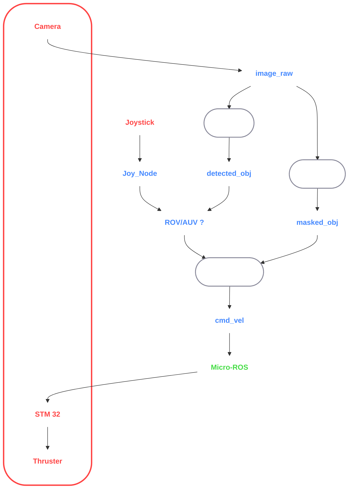

# C9MagangBanyubramanta – Firdaus Mangkona

Repositori ini berisi rangkuman proyek dan tugas saya selama mengikuti program magang di **Banyubramanta**. Setiap minggu berfokus pada integrasi teknologi seperti ROS2, OpenCV, YOLO, serial communication, dan simulasi Gazebo.

---

## Ringkasan Mingguan

### Week 1 – ROS2 Basic Controller
Pada minggu pertama, saya mempelajari dasar komunikasi antar node di ROS2 dan membuat **controllerNode** yang:
- Subscribe ke **joyNode**
- Publish ke **/cmd_vel**
- Mengontrol pergerakan robot/ROV menggunakan joystick

---

### Week 2 – OpenCV Color Detection
Minggu kedua fokus pada pengolahan citra menggunakan **OpenCV**, meliputi:
- Membaca input video
- Melakukan **color filtering** menggunakan HSV masking
- Menampilkan hasil deteksi warna objek

---

### Week 3 – ROS2 + OpenCV + YOLO Integration
Integrasi lanjutan antara ROS2 dan computer vision:
- Menggabungkan OpenCV dan YOLO untuk mendeteksi objek
- Melakukan masking video
- Memproses dan mengirim hasil deteksi antar node ROS2

---

### Week 4.1 – Serial Communication to STM32
Pada bagian pertama Week 4, saya:
- Mengintegrasikan ROS2 controller package dengan **serial communication**
- Mengirim data pergerakan ke **STM32**
- Menguji penerimaan data melalui serial monitor

---

### Week 4.2 – Gazebo Simulation for ROV
Pada bagian kedua Week 4:
- Menghubungkan controller package dengan **Gazebo Simulation**
- Mensimulasikan pergerakan dan kontrol **ROV**
- Menguji komunikasi antar node dalam lingkungan virtual

---
